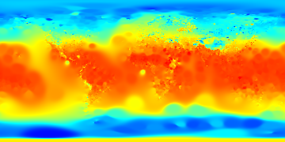
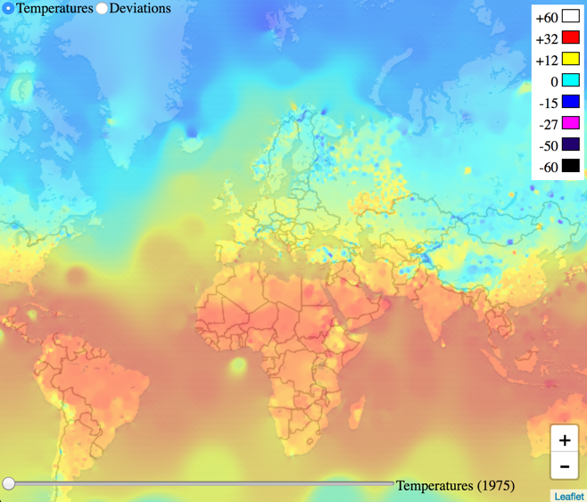
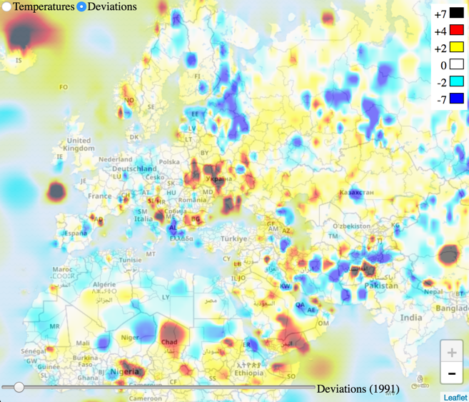

# World Climate

https://marcelocenerine.github.io/world-climate/static/

This app allows interative visualization of temperature evolution over time (1975 - 2015) based on real data collected by weather stations located all over the globe. This data comes from the [National Center for Environmental Information](https://www.ncei.noaa.gov/) of the United States.

This app uses spatial and linear interpolation algorithms to process the input data and produce the images (tiles) showed on the map. You can have two different perspectives of the data:

### Temperatures

### Deviations

P.S.: This app was developed as part of the Capstone project for the Functional Programming in Scala Specialization. The actual Scala code is not available in this repo.
